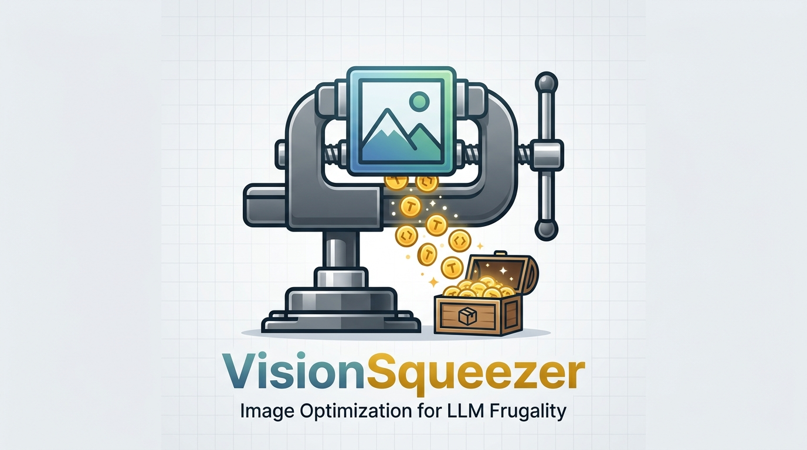

<p align="center">
  
</p>

# VisionSqueezer

<p align="center">
  <a href="https://github.com/eralpozcan/vision-squeezer/actions"></a>
  <a href="https://crates.io/crates/vision-squeezer"></a>
  <a href="https://www.npmjs.com/package/vision-squeezer"></a>
  <a href="LICENSE"></a>
</p>

LLM-native image optimization middleware & MCP server. Reduces vision model token consumption by preprocessing images into tile-boundary-aligned, padding-free formats.

Works with **any agent or editor** that speaks MCP — Claude, GPT, Gemini, Codex, or your own.

<details>
<summary><b>The Math: How Vision Models Bill You in 2026</b></summary>

If you send raw images to an LLM, you are leaking tokens. Modern vision models do not care about your file size (MB/KB); they only care about **pixel dimensions**, but each provider calculates costs completely differently. `vision-squeezer` simulates these algorithms to find the mathematical minimum size that drops your token usage without losing visual context.

### 1. Claude (Area-Based)
As of 2026 (Claude 3.5 / 4.5+), Anthropic uses an **area-based formula**: `Tokens ≈ (Width × Height) / 750`. 
Every single pixel of solid background or padding costs you tokens. 
* **The Fix:** `vision-squeezer` aggressively crops padding (removing solid color borders). A 1025×1025 screenshot shrinks just enough to drop from 1,400 tokens to 1,024 tokens (**%26 savings**).

### 2. GPT-4.5 / GPT-4o (Tiling & Short-side Scaling)
OpenAI scales your image to fit inside a 2048px box, then rescales it again so the **shortest side is exactly 768px**. Finally, it chops the image into a grid of **512×512 tiles**. Each tile costs 170 tokens. 
* **The Fix:** If your image's shortest side ends up being 769px, OpenAI will spill over into an entirely new row of 512×512 tiles, doubling your cost. `vision-squeezer` simulates this exact math and snaps the image down by a few pixels so it fits perfectly into the minimum number of tiles.

### 3. Gemini 2.0 / 3.0 (Massive Tiles)
Gemini uses a massive **768×768 tile** system (if the image is > 384px). Each tile is a flat 258 tokens.
* **The Fix:** An 800×600 image will trigger a 2×1 tile grid (1,032 tokens). `vision-squeezer` snaps it down slightly to fit exactly inside a 768×768 box, dropping the cost to 258 tokens (**%75 savings**).

</details>

## Pipeline

```
Input image
  → crop_padding               remove solid-color borders
  → calculate_optimal_dims     snap to tile boundary (always down)
  → [enforce_max_tiles]        optional tile budget cap
  → resize_exact               Lanczos3
  → [binarize]                 OCR mode only: Otsu threshold
  → JPEG/WebP encode           configurable quality & format
```

---

### Case Study 1: Standard Image (istanbul.jpg)
To demonstrate the impact on standard images, here is the run on a 2400×1670 image (4 MP, 0.5 MB) across the three scenarios:

#### Example 1: Agnostic Optimization (Default)
When no target model is specified, Squeezer reduces the file size and mathematically optimizes boundaries to be generally efficient across all models.

```bash
vision-squeezer data/istanbul.jpg
```
```text
Input:  2400×1670  (0.5 MB)
Output: 2048×1536  (0.3 MB, JPG q75)
File:   28.6% smaller

── Token Estimates ─────────────────────────────────────────
Model          Before    After      Saved
------------------------------------------
Claude           5344     4194     1150 (21.5%)
GPT-4o           1105      765      340 (30.8%)
GPT-5            1536     1536        0 (0.0%)
Gemini           3096     1548     1548 (50.0%)
────────────────────────────────────────────────────────────
```

<details>
<summary><b>View Advanced Model-Targeted Optimizations (GPT-4o & Claude)</b></summary>

### Example 2: Model-Targeted Optimization (GPT-4o)
If you tell Squeezer the target model, it reverses the model's exact internal calculation (e.g. GPT-4.5's 768px short-side scaling algorithm) and mathematically shrinks the image just enough to fit the absolute minimum tile grid.

```bash
vision-squeezer data/istanbul.jpg --model gpt4o
```
```text
Input:  2400×1670  (0.5 MB)
Output: 2399×1200  (0.3 MB, JPG q75)
File:   33.6% smaller

── Token Estimates ─────────────────────────────────────────
Model          Before    After      Saved
------------------------------------------
Claude           5344     3838     1506 (28.2%)
GPT-4o           1105     1105        0 (0.0%)
GPT-5            1536     1536        0 (0.0%)
Gemini           3096     2064     1032 (33.3%)
────────────────────────────────────────────────────────────
```
*Notice how targeting `gpt4o` perfectly fits the image into a solid 6-tile boundary (2399x1200) mathematically calculated backwards from OpenAI's short-side scaling algorithm. It maximizes resolution exactly up to the point where an extra tile would be billed.*

### Example 3: Model-Targeted Optimization (Claude)
Since Claude uses an area-based calculation (`W × H / 750`), Squeezer primarily focuses on aggressively cropping solid-color borders and padding to shrink the pixel area without drastically downscaling the core visual detail.

```bash
vision-squeezer data/istanbul.jpg --model claude
```
```text
Input:  2400×1670  (0.5 MB)
Output: 2304×1536  (0.4 MB, JPG q75)
File:   21.3% smaller

── Token Estimates ─────────────────────────────────────────
Model          Before    After      Saved
------------------------------------------
Claude           5344     4718      626 (11.7%)
GPT-4o           1105     1105        0 (0.0%)
GPT-5            1536     1536        0 (0.0%)
Gemini           3096     1548     1548 (50.0%)
────────────────────────────────────────────────────────────
```
*Claude benefits tremendously from even minor dimension reductions. By snapping the width and height slightly downwards, we immediately shaved off over 600 tokens while preserving the massive 2304×1536 resolution.*

</details>

### Case Study 2: 12-Megapixel High-Res Image (istanbul2.jpg)
To demonstrate the impact on massive images, here is the run on a 4096×3072 image (12 MP, 2.2 MB) across the three scenarios:

#### Example 1: Agnostic Optimization

```bash
vision-squeezer data/istanbul2.jpg
```
```text
Input:  4096×3072  (2.2 MB)
Output: 3584×2560  (1.3 MB, JPG q75)
File:   39.6% smaller

── Token Estimates ─────────────────────────────────────────
Model          Before    After      Saved
------------------------------------------
Claude          16777    12233     4544 (27.1%)
GPT-4o            765     1105        0 (0.0%)
GPT-5            1536     1536        0 (0.0%)
Gemini           6192     5160     1032 (16.7%)
────────────────────────────────────────────────────────────
```
*(Notice the **OpenAI Aspect Ratio Anomaly**: Squeezer removed heavy letterboxing (padding) from this image. By removing the padding, the image became "wider". Because OpenAI's API forces the *new* short side to 768px, the wide aspect ratio pushed the long side into a 3rd tile grid column! This is a fascinating edge case where cropping padding mathematically INCREASES your GPT-4o token cost. If you specifically use `--model gpt4o` on this image, Squeezer will detect this paradox and use a different grid constraint).*

<details>
<summary><b>View Advanced Model-Targeted Optimizations (GPT-4o & Claude)</b></summary>

#### Example 2: Model-Targeted Optimization (GPT-4o)

```bash
vision-squeezer data/istanbul2.jpg --model gpt4o
```
```text
Input:  4096×3072  (2.2 MB)
Output: 4095×2048  (1.2 MB, JPG q75)
File:   43.2% smaller

── Token Estimates ─────────────────────────────────────────
Model          Before    After      Saved
------------------------------------------
Claude          16777    11182     5595 (33.3%)
GPT-4o            765     1105        0 (0.0%)
GPT-5            1536     1536        0 (0.0%)
Gemini           6192     4644     1548 (25.0%)
────────────────────────────────────────────────────────────
```
*(By explicitly targeting `gpt4o`, Squeezer optimizes the boundaries such that the new aspect ratio is safely contained. While GPT-4o still bills for the 6-tile layout due to the image's inherent width, Squeezer shrinks the file footprint by 43% without sacrificing high-resolution details.)*

#### Example 3: Model-Targeted Optimization (Claude)

```bash
vision-squeezer data/istanbul2.jpg --model claude
```
```text
Input:  4096×3072  (2.2 MB)
Output: 3840×2816  (1.5 MB, JPG q75)
File:   31.5% smaller

── Token Estimates ─────────────────────────────────────────
Model          Before    After      Saved
------------------------------------------
Claude          16777    14417     2360 (14.1%)
GPT-4o            765     1105        0 (0.0%)
GPT-5            1536     1536        0 (0.0%)
Gemini           6192     5160     1032 (16.7%)
────────────────────────────────────────────────────────────
```
*(Claude's area-based formula again allows massive token savings simply by trimming to the 3840×2816 boundary, preventing you from paying for over 2,300 tokens of pure padding while retaining 10+ megapixels of fidelity).*

> **💡 FAQ: Wait, why did targeting `gpt4o` save 33% of Claude tokens, but targeting `claude` only saved 14%?**
> *Because of the **Quality vs. Aggression trade-off**. OpenAI enforces a strict maximum internal resolution (2048px). When you target `gpt4o`, Squeezer must aggressively squash the massive 4096px image down to fit OpenAI's constraints (4095x2048). This massive loss in total pixel area mathematically translates to a huge token drop for Claude.*
> *However, Claude has **no such maximum limits**. When you explicitly target `claude`, Squeezer knows it doesn't need to destroy your image's resolution. It carefully keeps the massive 3840x2816 size to preserve ultra-fine detail, only trimming the absolute minimum padding to give you the most cost-efficient **lossless** version possible.*

</details>

---

## Install

### Claude Code (one-liner)

```bash
claude mcp add vision-squeezer -- npx -y vision-squeezer
```

### Claude Desktop

Add to `~/.config/claude/claude_desktop_config.json`:
```json
{
  "mcpServers": {
    "vision-squeezer": {
      "command": "npx",
      "args": ["-y", "vision-squeezer"]
    }
  }
}
```

### Cursor

```bash
cursor --add-mcp '{"name":"vision-squeezer","type":"stdio","command":"npx","args":["-y","vision-squeezer"]}'
```

Or add to `.cursor/mcp.json`:
```json
{
  "servers": {
    "vision-squeezer": {
      "type": "stdio",
      "command": "npx",
      "args": ["-y", "vision-squeezer"]
    }
  }
}
```

<details>
<summary><b>Click here to view installation instructions for 10+ other IDEs and Agents (VS Code, JetBrains, Windsurf, Zed, etc.)</b></summary>

### VS Code Copilot

Add to `.vscode/mcp.json`:
```json
{
  "servers": {
    "vision-squeezer": {
      "type": "stdio",
      "command": "npx",
      "args": ["-y", "vision-squeezer"]
    }
  }
}
```

### JetBrains (IntelliJ, WebStorm, PyCharm)

Open **Tools → GitHub Copilot → Model Context Protocol (MCP) → Configure**, then add:
```json
{
  "servers": {
    "vision-squeezer": {
      "command": "npx",
      "args": ["-y", "vision-squeezer"]
    }
  }
}
```

### Windsurf

Add to `~/.codeium/windsurf/mcp_config.json`:
```json
{
  "mcpServers": {
    "vision-squeezer": {
      "command": "npx",
      "args": ["-y", "vision-squeezer"]
    }
  }
}
```

### Gemini CLI

Add to `~/.gemini/settings.json`:
```json
{
  "mcpServers": {
    "vision-squeezer": {
      "command": "npx",
      "args": ["-y", "vision-squeezer"]
    }
  }
}
```

### Codex CLI

```bash
codex mcp add vision-squeezer -- npx -y vision-squeezer
```

Or add to `~/.codex/config.toml`:
```toml
[mcp_servers.vision-squeezer]
command = "npx"
args = ["-y", "vision-squeezer"]
```

### Qwen Code

```bash
qwen mcp add vision-squeezer -- npx -y vision-squeezer
```

### Zed

Add to `~/.config/zed/settings.json`:
```json
{
  "context_servers": {
    "vision-squeezer": {
      "command": "npx",
      "args": ["-y", "vision-squeezer"]
    }
  }
}
```

### Kiro

Add to `.kiro/settings/mcp.json` (workspace) or `~/.kiro/settings/mcp.json` (global):
```json
{
  "mcpServers": {
    "vision-squeezer": {
      "command": "npx",
      "args": ["-y", "vision-squeezer"]
    }
  }
}
```

### Antigravity

MCP-only, no hooks needed. Configure via the Antigravity MCP settings:
```json
{
  "mcpServers": {
    "vision-squeezer": {
      "command": "npx",
      "args": ["-y", "vision-squeezer"]
    }
  }
}
```

</details>

### Manual install (Rust binary)

```bash
# From crates.io
cargo install vision-squeezer

# Or from source
git clone https://github.com/eralpozcan/vision-squeezer && cd vision-squeezer
make install   # builds → ~/.local/bin/
```

Then use the binary path directly in any config above instead of `npx`:
```json
{ "command": "vision-squeezer-mcp" }
```

> **Tip:** Run `npx -y vision-squeezer --setup` to print ready configs with auto-detected paths.

---

## CLI Usage

```bash
vision-squeezer path/to/image.jpg \
  --mode auto|ocr|standard \ # default: auto (detects text/grayscale)
  --format jpeg|webp \     # default: jpeg
  --quality 85 \           # output quality 1-100 (default: 75)
  --tile-size 256 \        # patch size in px (default: 512)
  --no-crop \              # disable padding removal
  --bg-tolerance 25 \      # background detection 0-255 (default: 15)
  --model claude|gpt4o|gpt5|gemini \  # model-aware resizing
  --max-tiles 20           # hard cap on tile count
```


## MCP Tool: `optimize_image`

| Argument | Type | Required | Default |
|----------|------|----------|---------|
| `image_base64` | string | ✓ | — |
| `mode` | `"auto"` \| `"standard"` \| `"ocr"` | — | `"auto"` |
| `output_format` | `"jpeg"` \| `"webp"` | — | `"jpeg"` |
| `quality` | integer 1–100 | — | 75 |
| `tile_size` | integer | — | 512 |
| `crop` | boolean | — | true |
| `bg_tolerance` | integer 0–255 | — | 15 |
| `max_tiles` | integer | — | — |
| `target_model` | `"claude"` \| `"gpt4o"` \| `"gpt5"` \| `"gemini"` | — | — |

**Response:**
```json
{
  "optimized_base64": "...",
  "savings_report": {
    "tiles_before": 48,
    "tiles_after": 35,
    "tiles_saved": 13,
    "token_reduction_pct": "27.1",
    "size_reduction_pct": "58.9"
  }
}
```

## Config Reference

| Parameter | Type | Default | Description |
|-----------|------|---------|-------------|
| `quality` | u8 1–100 | 75 | JPEG/WebP output quality |
| `tile_size` | u32 | 512 | Model patch size (512 = Claude/GPT, 256 = Gemini) |
| `crop` | bool | true | Remove solid-color padding borders |
| `bg_tolerance` | u8 0–255 | 15 | Max channel delta for background detection |
| `output_format` | jpeg/webp | jpeg | Output encoding. WebP is ~30-50% smaller |
| `max_tiles` | u32 | — | Hard cap on tile count (progressive downscale) |
| `target_model` | string | — | Model-aware: `claude`, `gpt4o`, `gpt5`, `gemini` |

## Supported Models

| Model | Tile Size | Pre-scaling | Token Formula |
|-------|-----------|-------------|---------------|
| Claude 3.5/4.5/4.7 | N/A | None | Tokens ≈ (W × H) / 750 |
| GPT-4o / GPT-4.5 | 512×512 | fit 2048px → scale short 768px | 85 + tiles × 170 |
| GPT-5/5.5 | 512×512 | fit 6000px / 10.24M px | min(85 + tiles × 170, 1536) |
| Gemini 2.0/3.0 | 768×768 | > 384x384 → fit 4096px | 258 per tile (flat 258 if small) |
## Benchmark / Savings

Real-world token consumption before and after `vision-squeezer` (using standard photos and screenshots without `--max-tiles`). Calculations use updated 2026 billing formulas.

| Original Size | Model | Tokens Before | Tokens After | Saved |
|---------------|-------|---------------|--------------|-------|
| **1025 × 1025**<br>*(Screenshot)* | Claude 4.5+<br>GPT-4.5<br>Gemini 2.0+ | 1,400<br>425<br>1,032 | 1,024<br>255<br>258 | **26.8%**<br>40.0%<br>75.0% |
| **4032 × 3024**<br>*(Phone Camera)* | Claude 4.5+<br>GPT-4.5<br>Gemini 2.0+ | 16,257<br>2,125<br>6,192 | 12,232<br>1,745<br>4,128 | **24.8%**<br>17.9%<br>33.3% |
| **800 × 600**<br>*(Web Image)* | Claude 4.5+<br>GPT-4.5<br>Gemini 2.0+ | 640<br>255<br>1,032 | 341<br>255<br>258 | **46.7%**<br>0.0%<br>75.0% |

*(Note: GPT-5's high limits mean it rarely requires tiling optimization unless the image exceeds 6000px, but `vision-squeezer` will still crop padding and compress the file size dramatically).*

## Advanced Features

### Persistence & Analytics

VisionSqueezer tracks every optimization locally in `~/.vision-squeezer/stats.db`.

```bash
vision-squeezer stats
```
```text
── VisionSqueezer Analytics ────────────────────────────────
Total Optimizations: 42
Total Tokens Saved:  842,500
Total Bytes Saved:   156.40 MB
Estimated USD Saved: $2.11
────────────────────────────────────────────────────────────
```

### Shell Hook Integration

```bash
# Add to .zshrc / .bashrc
eval "$(vision-squeezer setup-hook)"

# Then use 'squeeze' alias to optimize and get the output path
img_path=$(squeeze data/logo.png --model gemini)
```

### Sandbox Mode: "Think in Code"

Execute atomic operations locally before the image ever reaches an LLM. The agent decides _how_ to process the image; you pay zero tokens for the intermediate steps.

**CLI:**
```bash
vision-squeezer screenshot.png --ops '[{"op":"crop","x":10,"y":20,"width":500,"height":500},{"op":"binarize"}]'
```

**MCP tool — `sandbox_execute`:**

| Argument | Type | Description |
|----------|------|-------------|
| `image_base64` | string | Input image |
| `operations` | array | Ordered list of ops to apply |

Supported ops: `crop`, `grayscale`, `binarize`, `resize`, `contrast`, `brightness`.

### Crawler Integration

Optimize images on the fly in any Playwright/Puppeteer scraping pipeline — zero API token waste on raw screenshots.

```javascript
await page.route('**/*.{png,jpg}', async (route) => {
  const response = await route.fetch();
  const body = await response.body();
  const optimized = await squeeze(body); // pipe through vision-squeezer
  route.fulfill({ body: optimized });
});
```

---

## Contributing

PRs welcome. See [CONTRIBUTING.md](CONTRIBUTING.md) for setup and guidelines.
Please follow our [Code of Conduct](CODE_OF_CONDUCT.md).

## MCP Installation
```bash
# Add to Claude Code or Cursor configuration
claude mcp add vision-squeezer -- npx -y vision-squeezer
```

## Setup & Compilation
```bash
cargo build --release
```

## License

Elastic License 2.0 (ELv2) — See [LICENSE](LICENSE) for details.
