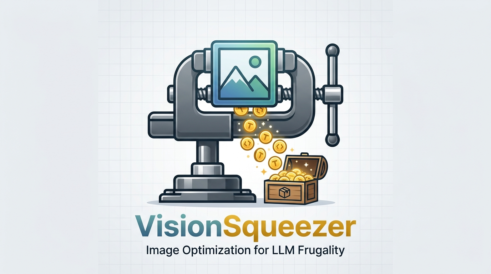

<p align="center">
  
</p>

# VisionSqueezer

<p align="center">
  <a href="https://github.com/eralpozcan/vision-squeezer/actions"></a>
  <a href="https://crates.io/crates/vision-squeezer"></a>
  <a href="https://www.npmjs.com/package/vision-squeezer"></a>
  <a href="LICENSE"></a>
</p>

Fit images to a vision-LLM token budget **before** they reach the model. A library, CLI, and MCP server for code, agents, and pipelines.

> **What it does not do.** VisionSqueezer cannot shrink an image you paste, drag, or `@`-attach into a chat window (Claude Code, Cursor, ChatGPT, and so on). The client attaches it before any tool or hook runs, so it is billed at full size.
>
> **Where it does save tokens:**
> - Images your code sends to a model API: the Rust crate, the Python bindings, the CLI.
> - Images an agent reads from files or gets through tools (screenshots, crawlers, browser automation): the MCP server, or the Claude Code image-read hook for files inside the project.
>
> See [Where it saves tokens](#where-it-saves-tokens) for the exact cases.

The MCP server runs in any MCP client (Claude Code, Cursor, Codex, Gemini CLI, and others), but it only sees images the agent passes to it.

---

## Install

### One command per client (recommended)

```bash
npx vision-squeezer install                       # asks for the client and scope
npx vision-squeezer install --client claude --scope user --yes
npx vision-squeezer install --client cursor --yes
```

Every client has exactly one install path, and the installer picks it:

| Client | What `install` does |
|---|---|
| Claude Code | Installs the `vision-squeezer-mcp` plugin: MCP server, `/vision-stats` `/vision-doctor` `/vision-upgrade` skills, and the image-read hook |
| Codex CLI, Qwen Code, Kimi CLI | Runs `<cli> mcp add vision-squeezer -- npx -y vision-squeezer@<version>` |
| Gemini CLI | Same `mcp add`, plus an image-read hook in `settings.json` |
| VS Code | Runs `code --add-mcp` |
| Cursor | Merges one pinned entry into `mcp.json`, plus an image-read hook in `hooks.json` |
| OpenCode | Merges one pinned entry into `opencode.json`, plus an image-read plugin |
| Windsurf, Claude Desktop | Merges one pinned entry into the client's JSON config |

JSON files are merged, never replaced: other servers and hooks are kept, a file that cannot be parsed is left untouched, and re-running replaces our own entry instead of adding a second.

The scope (`user`, `local`, `project`) is asked only when the client supports more than one. `--method` from older versions is accepted and ignored.

### Claude Code

```bash
npx vision-squeezer install --client claude --scope user --yes
```

This runs the two commands below for you (and removes an older `claude mcp add` registration and `settings.json` hook first). To do it by hand:

```bash
claude plugin marketplace add eralpozcan/vision-squeezer
claude plugin install vision-squeezer-mcp@vision-squeezer --scope user
```

Restart Claude Code, or run `/reload-plugins`, to load the MCP server, skills, and hook. Only want the MCP server, with no skills and no hook? `claude mcp add --scope user vision-squeezer -- npx -y vision-squeezer`.

### Claude Desktop

```bash
npx vision-squeezer install --client claude-desktop --yes
```

Or add to `claude_desktop_config.json` (macOS: `~/Library/Application Support/Claude/`, Windows: `%APPDATA%\\Claude\\`):
```json
{
  "mcpServers": {
    "vision-squeezer": {
      "command": "npx",
      "args": ["-y", "vision-squeezer"]
    }
  }
}
```

### Cursor

```bash
npx vision-squeezer install --client cursor --yes
```

Or add to `~/.cursor/mcp.json` (global) or `.cursor/mcp.json` (project):
```json
{
  "mcpServers": {
    "vision-squeezer": {
      "command": "npx",
      "args": ["-y", "vision-squeezer"]
    }
  }
}
```

<details>
<summary><b>Click here to view installation instructions for 10+ other IDEs and Agents (VS Code, JetBrains, Windsurf, Zed, etc.)</b></summary>

### VS Code Copilot

```bash
code --add-mcp '{"name":"vision-squeezer","command":"npx","args":["-y","vision-squeezer"]}'
```

Or add to `.vscode/mcp.json`:
```json
{
  "servers": {
    "vision-squeezer": {
      "type": "stdio",
      "command": "npx",
      "args": ["-y", "vision-squeezer"]
    }
  }
}
```

### JetBrains (IntelliJ, WebStorm, PyCharm)

Open **Tools → GitHub Copilot → Model Context Protocol (MCP) → Configure**, then add:
```json
{
  "servers": {
    "vision-squeezer": {
      "command": "npx",
      "args": ["-y", "vision-squeezer"]
    }
  }
}
```

### Windsurf

```bash
npx vision-squeezer install --client windsurf --yes
```

Or add to `~/.codeium/windsurf/mcp_config.json`:
```json
{
  "mcpServers": {
    "vision-squeezer": {
      "command": "npx",
      "args": ["-y", "vision-squeezer"]
    }
  }
}
```

### Gemini CLI

```bash
gemini mcp add --scope user vision-squeezer -- npx -y vision-squeezer
```

Or add to `~/.gemini/settings.json` (user) / `.gemini/settings.json` (project):
```json
{
  "mcpServers": {
    "vision-squeezer": {
      "command": "npx",
      "args": ["-y", "vision-squeezer"]
    }
  }
}
```

### Codex CLI

```bash
codex mcp add vision-squeezer -- npx -y vision-squeezer
```

Or add to `~/.codex/config.toml`:
```toml
[mcp_servers.vision-squeezer]
command = "npx"
args = ["-y", "vision-squeezer"]
```

### Qwen Code

```bash
qwen mcp add vision-squeezer -- npx -y vision-squeezer
```

### OpenCode

`opencode mcp add` is interactive-only, so add directly to `~/.config/opencode/opencode.json` (global) or `opencode.json` in the repo root (project):
```json
{
  "mcp": {
    "vision-squeezer": {
      "type": "local",
      "command": ["npx", "-y", "vision-squeezer"],
      "enabled": true
    }
  }
}
```

### Kimi CLI

```bash
kimi mcp add vision-squeezer -- npx -y vision-squeezer
```

### Zed

Add to `~/.config/zed/settings.json`:
```json
{
  "context_servers": {
    "vision-squeezer": {
      "command": "npx",
      "args": ["-y", "vision-squeezer"]
    }
  }
}
```

### Kiro

Add to `.kiro/settings/mcp.json` (workspace) or `~/.kiro/settings/mcp.json` (global):
```json
{
  "mcpServers": {
    "vision-squeezer": {
      "command": "npx",
      "args": ["-y", "vision-squeezer"]
    }
  }
}
```

### Antigravity

MCP-only, no hooks needed. Configure via the Antigravity MCP settings:
```json
{
  "mcpServers": {
    "vision-squeezer": {
      "command": "npx",
      "args": ["-y", "vision-squeezer"]
    }
  }
}
```

</details>

### Manual install (Rust binary)

```bash
# From crates.io
cargo install vision-squeezer

# Or from source
git clone https://github.com/eralpozcan/vision-squeezer && cd vision-squeezer
make install   # builds → ~/.local/bin/
```

Then use the binary path directly in any config above instead of `npx`:
```json
{ "command": "vision-squeezer-mcp" }
```

> **Tip:** Run `npx -y vision-squeezer --setup` to print ready configs with auto-detected paths.

---

## CLI Usage

```bash
vision-squeezer path/to/image.jpg \
  --mode auto|ocr|standard \      # default: auto (= standard, keeps colour; ocr is opt-in)
  --format jpeg|webp|avif \       # default: jpeg
  --quality 85 \                  # output quality 1-100 (default: 75)
  --tile-size 256 \               # patch size in px (default: 512)
  --no-crop \                     # disable padding removal
  --smart-crop \                  # edge-energy crop (vs corner-tolerance)
  --auto-quality 0.95 \           # binary-search quality to hit SSIM target
  --bg-tolerance 25 \             # background detection 0-255 (default: 15)
  --model <provider-alias> \ # model-aware resizing; see the model catalog
  --max-tokens 1600 \            # token budget: downscale until the output fits (0 = off; MCP default 1600)
  --max-tiles 20 \                # hard cap on tile count (model-specific unit)
  --json \                        # machine-readable JSON output
  --dry-run                       # run pipeline, skip disk write
```

### Batch mode

Pass a directory instead of a file:

```bash
vision-squeezer ./screenshots --recursive --output-dir ./optimized
vision-squeezer ./screenshots --recursive --json > report.json
```

---

<details>
<summary><b>The Math: How Vision Models Bill You in 2026</b></summary>

If you send raw images to an LLM, you are leaking tokens. Modern vision models do not care about your file size (MB/KB); they only care about **pixel dimensions**, but each provider calculates costs completely differently. `vision-squeezer` simulates these algorithms to find the mathematical minimum size that drops your token usage without losing visual context.

### 1. OpenAI GPT-6 / GPT-5.6 (32px Patches)
Current OpenAI vision models count **32×32 patches**, fit high-detail images within a 2048px edge and 2500-patch budget, then apply a 1.2 multiplier.
* **The Fix:** `--model gpt6` removes padding, fits the patch budget, and avoids partially used edge patches. A 1024×1024 input is 1024 patches / 1229 tokens.

### 2. Claude 4.7+ (28px Patches)
Claude counts `ceil(Width/28) × ceil(Height/28)` visual tokens. Claude 4.7+ high-resolution vision uses a 2576px edge and 4784-token budget; `claude-standard` covers the earlier 1568px / 1568-token tier.
* **The Fix:** Strip padding, fit the selected tier, and align dimensions to the 28px grid.

### 3. Gemini 3 (Large Tiles)
Gemini uses a massive **768×768 tile** system (if the image is > 384px). Each tile is a flat 258 tokens.
* **The Fix:** An 800×600 image triggers a 2×1 tile grid (516 tokens). `vision-squeezer` snaps it down slightly to fit exactly inside a 768×768 box, dropping the cost to 258 tokens (**50% savings**).

### 4. Llama 3.2 / 3.3 Vision (560px Tiles)
Meta's Mllama vision tiles images on a **560×560** grid, capped at 4 tiles (~1601 tokens each).
* **The Fix:** A 2400×1670 screenshot trimmed to 2400×1200 drops from a 2×2 to a 2×1 canvas: **6,404 → 3,202 tokens (−50%)**. (Llama 4 uses a different vision encoder and is not modeled.)

### 5. Qwen2-VL / 2.5-VL / 3-VL (28px Patch Grid)
Alibaba's Qwen-VL uses a **28px effective grid** (14px patch × 2×2 merge); `tokens = (W/28)·(H/28)` bounded to `[4, 16384]`.
* **The Fix:** The patch is small, so area is the lever — a 1024×1024 image with its border stripped to 896×896 drops **1,369 → 1,024 tokens (−25%)**.

### 6. DeepSeek Flash / DeepSeek-VL2
DeepSeek Flash now accepts images through its OpenAI-compatible API and documents an upper bound of **384 image tokens per image**. Use `--model deepseek` for the API profile; use `--model deepseek-local` for the exact DeepSeek-VL2 open-weight tile math.

### 7. Kimi K2.5 / K2.6 / K3
Kimi supports native image and video input through Moonshot's OpenAI-compatible API. Moonshot does not publish a stable image billing grid, so `--model kimi` gives an advisory native-resolution estimate while still applying exact crop and file-size optimization.

### 8. DeepSeek-VL2 (384px Anyres Tiles)
SigLIP-384 + 2× pixel-shuffle gives 196 tokens/tile on a `(m·384, n·384)` canvas (`m·n ≤ 9`).
* **The Fix:** An 800×768 image snapped to 768×768 drops from 3×2 to 2×2 tiles: **1,415 → 1,023 tokens (−28%)**. (Open weights — the win is local-inference context, not API billing.)

Legacy `gpt4o` and `gpt5` profiles remain available for endpoints that still use 512px high-detail tiles.

> Full provider math and sources: **[visionsqueezer.com/providers](https://visionsqueezer.com/providers/claude)**

</details>

## Pipeline

```
Input image
  → crop_padding               remove solid-color borders
  → calculate_optimal_dims     snap to tile boundary (always down)
  → [enforce_max_tokens]       token budget (MCP default 1600) / optional tile cap
  → resize_exact               Lanczos3
  → [binarize]                 OCR mode only: Otsu threshold
  → JPEG/WebP encode           configurable quality & format
```

### 🦀 Why Rust?

VisionSqueezer is a performance-critical middleware. We chose Rust for three uncompromising reasons:

- **Invisible Latency:** Image processing should never be the bottleneck. Rust ensures that snapping, cropping, and encoding happen in milliseconds, making the optimization layer truly invisible to the developer's workflow.
- **Minimal Footprint:** As an MCP server running in the background of your IDE, VisionSqueezer is designed to be ultra-lightweight, consuming near-zero CPU and RAM when idle.
- **Wasm-Ready:** Rust's first-class support for WebAssembly allows us to bring the same high-performance optimization to the browser and the Edge (Cloudflare Workers), enabling client-side squeezing before the image even hits the network.

---

### Benchmark snapshots

Captured with `vision-squeezer <image> [flags] --dry-run --json` on the sample images in `data/`. **The goal is fewer tokens, not fewer megabytes**: providers bill by pixel dimensions, so file size only matters for upload and latency. Without a budget the pipeline snaps to a grid and crops padding, which saves little on large photos because providers already downscale oversized images themselves. A token budget (`--max-tokens`, default **1600** in the MCP server) is what makes the saving real.

### Case Study 1: Standard image (istanbul.jpg)
2400×1670, 0.5 MB.

| Run | Output | File size | Claude 4.7+ tokens | GPT-6 tokens | Gemini tokens |
|---|---|---|---|---|---|
| *no budget* (pre-0.7 default) | 2048×1536 | −29% | 4,674 → 4,070 (−13%) | 2,903 → 2,942 | 3,096 → 1,548 (−50%) |
| `--max-tokens 1600` (MCP default) | 1344×924 | −67% | 4,674 → 1,584 (−66%) | 2,903 → 1,462 (−50%) | 3,096 → 1,032 (−67%) |
| `--max-tokens 1000` | 1064×728 | −79% | 4,674 → 988 (−79%) | 2,903 → 939 (−68%) | 3,096 → 516 (−83%) |
| `--max-tokens 1600 --model gpt6` | 1408×960 | −65% | 4,674 → 1,785 (−62%) | 2,903 → 1,584 (−45%) | 3,096 → 1,032 (−67%) |
| `--max-tokens 1600 --model gemini` | 2304×1536 | −22% | 4,674 → 4,565 (−2%) | 2,903 → 2,880 (−1%) | 3,096 → 1,548 (−50%) |

```bash
vision-squeezer data/istanbul.jpg --max-tokens 1600
```
```text
Input:  2400×1670  (0.5 MB)
Output: 1344×924  (0.2 MB, JPG q75)
File:   67.5% smaller

── Token Estimates ─────────────────────────────────────────
Model          Before    After      Saved
------------------------------------------
Claude 4.7+      4674     1584     3090 (66.1%)
GPT-6            2903     1462     1441 (49.6%)
GPT-4o           1105     1105        0 (0.0%)
GPT-5             910      910        0 (0.0%)
Gemini           3096     1032     2064 (66.7%)
────────────────────────────────────────────────────────────
```

### Case Study 2: 12-megapixel image (istanbul2.jpg)
4096×3072, 2.2 MB.

| Run | Output | File size | Claude 4.7+ tokens | GPT-6 tokens | Gemini tokens |
|---|---|---|---|---|---|
| *no budget* (pre-0.7 default) | 3584×2560 | −40% | 4,661 → 4,698 | 2,942 → 2,924 (−1%) | 6,192 → 5,160 (−17%) |
| `--max-tokens 1600` (MCP default) | 1288×952 | −88% | 4,661 → 1,564 (−66%) | 2,942 → 1,476 (−50%) | 6,192 → 1,032 (−83%) |
| `--max-tokens 1000` | 1036×756 | −92% | 4,661 → 999 (−79%) | 2,942 → 951 (−68%) | 6,192 → 516 (−92%) |
| `--max-tokens 1600 --model gpt6` | 1344×992 | −87% | 4,661 → 1,728 (−63%) | 2,942 → 1,563 (−47%) | 6,192 → 1,032 (−83%) |
| `--max-tokens 1600 --model gemini` | 2304×1536 | −71% | 4,661 → 4,565 (−2%) | 2,942 → 2,880 (−2%) | 6,192 → 1,548 (−75%) |

```bash
vision-squeezer data/istanbul2.jpg --max-tokens 1600
```
```text
Input:  4096×3072  (2.2 MB)
Output: 1288×952  (0.3 MB, JPG q75)
File:   87.9% smaller

── Token Estimates ─────────────────────────────────────────
Model          Before    After      Saved
------------------------------------------
Claude 4.7+      4661     1564     3097 (66.4%)
GPT-6            2942     1476     1466 (49.8%)
GPT-4o            765     1105        0 (0.0%)
GPT-5             630      910        0 (0.0%)
Gemini           6192     1032     5160 (83.3%)
────────────────────────────────────────────────────────────
```

### Reading the numbers

- **Budget off, tokens barely move.** Claude 4.7+ already caps images at 4,784 tokens, so a 4,661-token original can come out at 4,698. The squeezed file is smaller, the bill is not.
- **`--max-tokens 1600` cuts Claude tokens by ~66% and GPT-6 by ~50%** on both photos while keeping composition, colour and large text. Fine detail (distant windows, small signs) is what goes first.
- **The budget is measured with the target model**, Claude when none is set. `--model gemini` with the same 1600 lands on Gemini's 768px tile grid (1,032 tokens), and the file-size column follows.
- **Pick the budget for your content.** 1600 and 1000 kept body text legible in a retina code screenshot; 600 did not. Pass `--max-tokens 0` (or omit it on the CLI) to disable the cap.
- **Colour is never dropped.** `auto` mode behaves like `standard`; black-and-white output only happens with an explicit `--mode ocr`.

---

## Current model sanity checks

| Profile | Input | Estimated tokens |
| --- | --- | ---: |
| GPT-6 / GPT-5.6 | 1024×1024 | 1,229 |
| GPT-6 / GPT-5.6 | 2048×2048 | 3,000 after the 2,500-patch cap |
| Claude 4.7+ | 1000×1000 | 1,296 |
| Legacy GPT-5 / 5.1 | 1024×1024 | 630 |

---

## MCP Tool: `optimize_image`

| Argument | Type | Required | Default |
|----------|------|----------|---------|
| `image_path` | string | one of the two | — (preferred: read locally, optimized copy also written to a temp file) |
| `image_base64` | string | one of the two | — |
| `mode` | `"auto"` \| `"standard"` \| `"ocr"` | — | `"auto"` |
| `output_format` | `"jpeg"` \| `"webp"` | — | `"jpeg"` |
| `quality` | integer 1–100 | — | 75 |
| `tile_size` | integer | — | 512 |
| `crop` | boolean | — | true |
| `bg_tolerance` | integer 0–255 | — | 15 |
| `max_tokens` | integer | — | 1600 (`0` disables the cap) |
| `max_tiles` | integer | — | — |
| `target_model` | string enum | — | Core models plus `glm`, `pixtral`, `gemma`, `internvl`, `minicpm`, `molmo`, `aya`, `phi4`, `granite`, `llava`, `falcon`, `minimax`, `step`, `ling`, `voyage` |

**Response:** an MCP `image` block with the optimized image, then a text block with a small report. The image is never base64 inside the text: a model reads that as text tokens, which would cost more than the image it replaces.
```json
{
  "width": 1344,
  "height": 924,
  "output_path": "/tmp/vision-squeezer/shot-1a2b3c4d.jpg",
  "tokens_before": 4674,
  "tokens_after": 1584,
  "savings_report": {
    "tiles_before": 4674,
    "tiles_after": 1584,
    "tiles_saved": 3090,
    "token_reduction_pct": "66.1",
    "size_reduction_pct": "67.5"
  }
}
```
`output_path` is set when the input was an `image_path`.

### Where it saves tokens

The optimization only helps if the **smaller image is what reaches the model**. What that means in practice:

| How the image gets to the model | Optimized? |
|---|---|
| Claude Code reads an image file inside your project (`Read`) | **Yes**, by the image-read hook that ships with the plugin (`install --client claude`) |
| The agent calls `optimize_image` with an `image_path` | **Yes**, from any folder. Tell your agent to do this in `CLAUDE.md` / `AGENTS.md` |
| You paste or drag an image into the chat | **No.** The client attaches it before any tool or hook runs |
| You attach a file with `@path` | **No.** No tool call happens, so no hook fires |

**The baseline matters.** Claude Code already downsizes large images before it sends them: in our test a 2400×1670 file reached the model as 1999×1392. Against that, the 1600-token budget saves about 56% on `istanbul.jpg` (about 3,600 → 1,584 estimated tokens), not the 66% measured against the original file. All token counts here are estimates from each provider's published rules, not billed usage.

| Client | Image-read hook | Status |
|---|---|---|
| Claude Code | Yes, `PreToolUse` on `Read` (plugin) | Tested in a live session |
| Cursor | Yes, `preToolUse` + `updated_input` on `Read` (`hooks.json`) | Follows Cursor's docs, not tested in the app |
| Gemini CLI | Yes, `BeforeTool` on `read_file` (`settings.json`) | Follows Gemini's docs, not tested in the app. Google replaced Gemini CLI with Antigravity CLI for free and Google One users on 2026-06-18 |
| OpenCode | Yes, a plugin on `tool.execute.before` for `read` | Follows OpenCode's docs, not tested in the app |
| Codex CLI | No. Hooks can rewrite a call, but Codex's docs list no image-read tool path | MCP tool only |
| Windsurf | No. `pre_read_code` can only block | MCP tool only |
| VS Code Copilot | No. The docs show no way to rewrite a tool input | MCP tool only |
| Kimi CLI | No. `PreToolUse` shows the input but the docs describe no rewrite | MCP tool only |
| Qwen Code, Claude Desktop | Not checked / no hook system | MCP tool only |

"MCP tool only" means the agent has to call `optimize_image` itself with an `image_path`; tell it to in `AGENTS.md`. The hooks for Cursor, Gemini CLI, and OpenCode keep their copy in a self-ignoring `.vision-squeezer/` folder inside the project, because those clients restrict reads to the workspace.

Save screenshots into the project (for example `screenshots/`) and reference them by path to get the saving. The hook only rewrites files inside the project: it answers with an allow decision, so it must not open files a plain `Read` would have asked about.

## Config Reference

| Parameter | Type | Default | Description |
|-----------|------|---------|-------------|
| `quality` | u8 1–100 | 75 | JPEG/WebP output quality |
| `tile_size` | u32 | 512 | Custom grid size; ignored when `target_model` is set |
| `crop` | bool | true | Remove solid-color padding borders |
| `bg_tolerance` | u8 0–255 | 15 | Max channel delta for background detection |
| `output_format` | jpeg/webp | jpeg | Output encoding. WebP is ~30-50% smaller |
| `max_tiles` | u32 | — | Hard cap on tile count (progressive downscale) |
| `target_model` | string | — | Model-aware profile; use `gpt6` for current OpenAI models |

## Supported Models

## Platform support

Prebuilt MCP binaries cover Linux x86_64/ARM64, macOS Apple Silicon/Intel, and Windows x86_64/ARM64. Python wheels cover Linux x86_64/ARM64, macOS Apple Silicon/Intel, and Windows x86_64. Unsupported Python architectures can install from source with `pip install --no-binary vision-squeezer vision-squeezer`.

| Model | Tile Size | Pre-scaling | Token Formula |
|-------|-----------|-------------|---------------|
| GPT-6 / GPT-5.6 | 32×32 patches | 2048px edge / 2500 patches | ceil(patches × 1.2) |
| Claude 4.7+ high resolution | 28×28 patches | 2576px edge / 4784 patches | 1 token per patch |
| Claude standard | 28×28 patches | 1568px edge / 1568 patches | 1 token per patch |
| GPT-4o / GPT-4.5 (legacy) | 512×512 | fit 2048px → scale short 768px | 85 + tiles × 170 |
| GPT-5 / GPT-5.1 (legacy) | 512×512 | fit 2048px → scale short 768px | 70 + tiles × 140 |
| Gemini 3 | 768×768 | flat tier at ≤384×384 | 258 per tile |
| DeepSeek Flash | provider-managed | up to 384 image tokens | conservative 384-token cap |
| Kimi K2.5/K2.6/K3 | native-resolution | provider-specific | advisory 28px estimate |
| GLM, Pixtral/Mistral, Gemma, InternVL | provider-specific | provider-specific | advisory generic profile |
| MiniCPM, Molmo, Aya, Phi-4, Granite | provider-specific | provider-specific | advisory generic profile |
| LLaVA, Falcon, MiniMax, Step, Ling, Voyage | provider-specific | provider-specific | advisory generic profile |

---

## Advanced Features

### Persistence & Analytics

VisionSqueezer tracks every optimization locally in `~/.vision-squeezer/stats.db`.

```bash
vision-squeezer stats
```
```text
── VisionSqueezer Analytics ────────────────────────────────
Total Optimizations: 42
Total Tokens Saved:  842,500
Total Bytes Saved:   156.40 MB
Estimated USD Saved: $2.11
────────────────────────────────────────────────────────────
```

### Shell Hook & Claude Code Skills

Add to `.zshrc` / `.bashrc`:

```bash
eval "$(vision-squeezer setup-hook)"
```

This installs two things at once:

- **`squeeze` alias** — optimize and capture the output path in one step:
  ```bash
  img_path=$(squeeze data/logo.png --model gemini)
  ```
- **Claude Code skills** — written to `~/.claude/skills/` automatically on first run

#### Available Skills

| Skill | Trigger | What it does |
|-------|---------|--------------|
| `vision-stats` | `/vision-stats` | Show cumulative token & byte savings — reads local stats.db, zero MCP overhead |
| `vision-doctor` | `/vision-doctor` | Check installed version vs latest npm release, show update command if outdated |
| `vision-upgrade` | `/vision-upgrade` | Detect install method (cargo/npm/npx) and run the correct upgrade command |

**Example output:**

```
/vision-stats
── VisionSqueezer Analytics ────────────────────────────────
Total Optimizations: 42
Total Tokens Saved:  842,500
Total Bytes Saved:   156.40 MB
Estimated USD Saved: $2.11
────────────────────────────────────────────────────────────

/vision-doctor
## VisionSqueezer Doctor
- [x] Binary found: /usr/local/bin/vision-squeezer
- [x] Installed version: 0.1.8
- [x] Latest version (npm): 0.1.8
- [x] Status: Up to date
```

**Marketplace install** (alternative to `setup-hook`):
Add to `~/.claude/settings.json`:
```json
{
  "extraKnownMarketplaces": {
    "vision-squeezer": {
      "source": { "source": "github", "repo": "eralpozcan/vision-squeezer" }
    }
  }
}
```
Then run `/plugins add vision-stats@vision-squeezer`, `/plugins add vision-doctor@vision-squeezer`, or `/plugins add vision-upgrade@vision-squeezer` in Claude Code.

### Sandbox Mode: "Think in Code"

Execute atomic operations locally before the image ever reaches an LLM. The agent decides _how_ to process the image; you pay zero tokens for the intermediate steps.

**CLI:**
```bash
vision-squeezer screenshot.png --ops '[{"op":"crop","x":10,"y":20,"width":500,"height":500},{"op":"binarize"}]'
```

**MCP tool — `sandbox_execute`:**

| Argument | Type | Description |
|----------|------|-------------|
| `image_base64` | string | Input image |
| `operations` | array | Ordered list of ops to apply |

Supported ops: `crop`, `grayscale`, `binarize`, `resize`, `contrast`, `brightness`.

### Crawler Integration

Optimize images on the fly in any Playwright/Puppeteer scraping pipeline — zero API token waste on raw screenshots.

```javascript
await page.route('**/*.{png,jpg}', async (route) => {
  const response = await route.fetch();
  const body = await response.body();
  const optimized = await squeeze(body); // pipe through vision-squeezer
  route.fulfill({ body: optimized });
});
```

---

## Contributing

PRs welcome. See [CONTRIBUTING.md](CONTRIBUTING.md) for setup and guidelines.
Please follow our [Code of Conduct](CODE_OF_CONDUCT.md).

## License

Elastic License 2.0 (ELv2) — See [LICENSE](LICENSE) for details.
